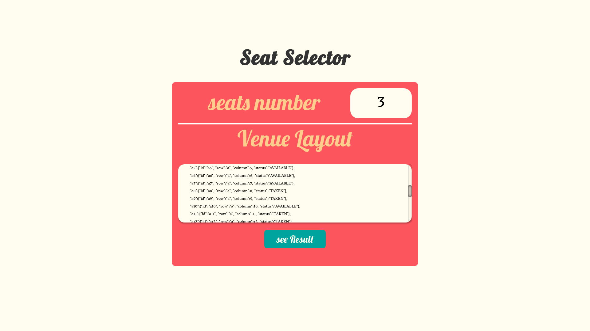
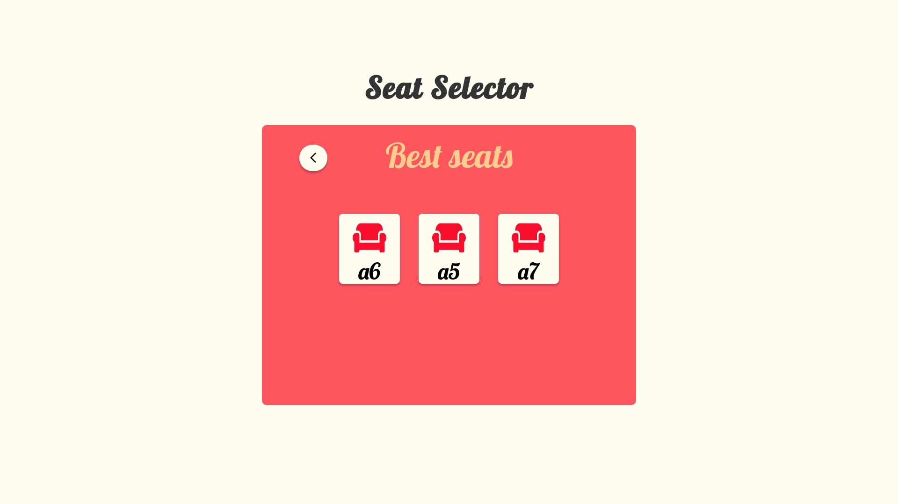

# SEAT SELECTOR

Are you tired of having to manually select the best seat for you (and your friends) ?

Now your problems are solved, using this app, you can easily select. Using the seat selector app you can easily insert the number of desired seats,
and the venue's layout





and the app will automatically select the best available seats for you




# How to run it

## Environment

In order to run it you must have a couple dependecies installed 

### front end Environment

In order to run the front end app, you must have :

- <a href="https://nodejs.org/en/download/" target="_blank">Node (version >= 10)</a>
- <a href="https://classic.yarnpkg.com" target="_blank">Yarn (optional)</a>


### Back end Environment

In order to run the back end API, you must have:

- <a href="https://www.ruby-lang.org/en/documentation/installation/" target="_blank">Ruby</a>
- <a href="https://guides.rubyonrails.org/v5.0/getting_started.html" target="_blank">Rails</a>


### Installing dependencies 

Once you have your environment set up, you have to install the app's dependencies

### Front end 

using your terminal navigate to the front_end folder and type

```
yarn install
```

or

```
npm i
```

### Back end

using your terminal navigate to the backend folder and type


```
bundle install
```

# Running the app

Once everything is set up, you can run the app by entering in the backend folder and typing

```
rails s
```

and after that, open another terminal, navigate to the front_end folder and type

```
yarn start
```

And your project will automatically open.